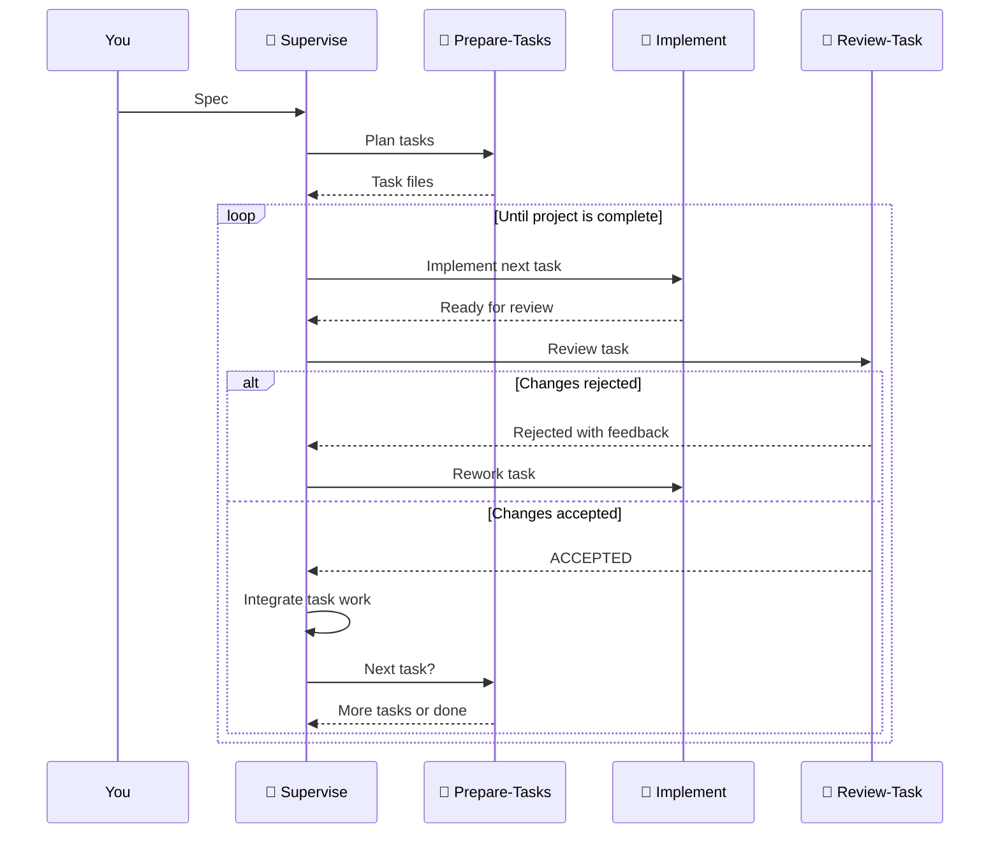

import PrepareTasksAgent from "/snippets/agents/prepare-tasks.mdx"
import ReviewTaskAgent from "/snippets/agents/review-task.mdx"
import ImplementAgent from "/snippets/agents/implement.mdx"
import SuperviseAgent from "/snippets/agents/supervise.mdx"

We've prepared some example skills and roles so your LLMs and AI agent harness can make the most of acai.sh.

## Acai Skill

The Acai CLI can output a premade acai skill to `.agents/skills/acai/SKILL.md`. The skill teaches your agent the basics of `feature.yaml` and spec-driven development. It consumes ~950 tokens of context.

Omit `--install` and it will write to `stdout`.
```sh
acai skill --install
```

If you don't have the cli yet, you can fetch the skill directly using `npx` or a similar command.
```sh
npx @acai.sh/cli skill --install
```

Just hand off your spec and watch them work!

## Spec-driven Software Factory
With custom agent and sub-agent roles, and a well-written spec, you can ship ambitious software with very little intervention. All you need are 4 role files, and [OpenCode](https://opencode.ai/).

Write a spec, hand it to the `supervise` agent, and let them handle the rest. It performs a planning, execution, and self-review loop until it believes the project is complete and high-quality.



### Factory Agent Roles
The following agent roles are compatible with **OpenCode's [custom agents](https://opencode.ai/docs/agents/).**
For planning roles, we recommend using more expensive frontier models. Configure the target model to fit your budget or existing subscriptions.

<Accordion title="agents/supervise.md">
  <SuperviseAgent />
</Accordion>
<Accordion title="agents/prepare-tasks.md">
  <PrepareTasksAgent />
</Accordion>
<Accordion title="agents/implement.md">
  <ImplementAgent />
</Accordion>
<Accordion title="agents/review-task.md">
  <ReviewTaskAgent />
</Accordion>

A system like this is empowered by acai.sh. Give your agent access to `acai` CLI and use the acai.sh dashboard to track their progress. Agents can use the CLI to read and write implementation progress, or even kick off automated tasks.

---

<Card title="Quickstart" icon="circle-play" horizontal href="/quickstart">
    View our quickstart page to install the CLI and play around.
</Card>
