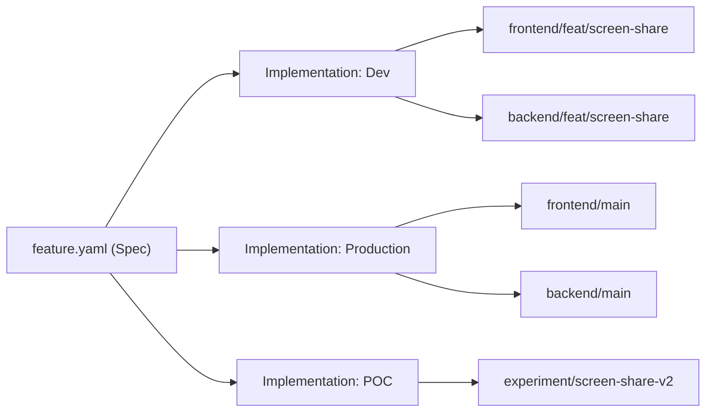

Most engineering teams today orient their tools and project trackers around diffs and PRs; e.g. “*Are these changes acceptable to merge to staging*? *Did this commit address the bug ticket?*”

With spec driven development, we shift the focus away from diffs and branches. Instead we care more about *implementations and their acceptability*.

Why?

- Because a complex feature can touch many codebases and branches.
    - `backend/feat/my-feature` + `frontend/feat/my-feature` + `db_service/123_migrate_my_tables`
- Because the same feature can have many implementations, for example:
    
    A) Production implementation
    
    B) Dev implementation
    
    C) Experimental / POC implementation

[acai.sh](http://acai.sh) tracks gitops but is not tightly coupled to your git branching strategy. In most cases, features and implementations will very closely mirror your git branching strategy. Here are some example git workflows, from the simplest to the most complex.

**Example 1: single-repo app (e.g. a stateless next.js app, an elixir phoenix monolith, etc.)**

- Your Dev implementation tracks a feature branch: `feat/my-feature-1`
- You and your agents review the Dev implementation and you mark all requirements as `ACCEPTED` in acai.sh
- You merge `feat/my-feature-1` into `main`
- [Acai.sh](http://Acai.sh) automatically promotes your Dev implementation to Production. The Dev implementation is marked as stale or deleted.
- Your Production implementation tracks the default branch: `main` or `master`

**Example 2: frontend/backend split (e.g. a frontend consuming an API, in separate repos)**

- Your Dev implementation tracks two feature branches: `frontend/feat/my-feature-1` and `backend/feat/my-feature-1`
- Process is similar to example 1. [Acai.sh](http://Acai.sh) detects when both branches have been merged to the default branches `frontend/main` and `backend/main`  - then auto-promotes the feature from Dev to Production in acai.sh.

**Example 3: multi-platform mobile apps with microservices (e.g. multiple teams operating at scale)**

When the number of requirements grows too large or complex to track in a single spec, you can easily divide a product in two.

- The microservice team creates a new [acai.sh](http://acai.sh) teamspace, creates a new product in it, and writes a standalone feature specs. The advantage is that a microservice spec only need to focus on serving the needs of it’s users (e.g. serving data to the iOS and Android teams)
- The separate teams coordinate by sharing access to eachothers workspaces and by flagging dependencies across them.
- Agents can ship across all repos and products while sharing [acai.sh](http://acai.sh) as a central source of truth.

## Understanding acceptance, status, and assignments

When a user marks a requirement as “Accepted”, they are really saying *this specific implementation passes the acceptance criteria*

When a requirement is marked as “Assigned”, we are really saying *someone is responsible for this requirement on this specific implementation.* If you want to have two different assignees working on the same requirement, you need to create a separate Implementation for each of them.

When an AI agent marks a requirement as “implemented”, they are really saying, *I have attempted to implement the requirement on all of the relevant branches.*

When an AI agent marks a requirement as “incomplete”, they are really saying, *I made code changes related to this implementation but was not able to complete it.* More changes are needed on one or more branches before it can be marked complete.
