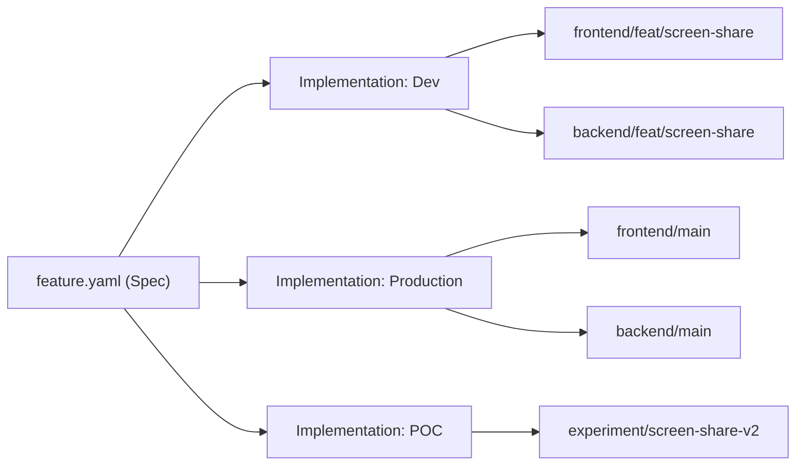

In acai.sh, we track specs (feature.yaml) and their implementations. So what happens when a feature spans many branches (frontend + backend + services), and has many implementations (production + dev + prototype)?

And what happens if the spec itself evolves between implementations? Or if I integrate work from one branch into another?

**Acai.sh handles all of these situations gracefully**. To learn more, pick from one of the example projects below and we will explain how acai.sh manages your specs and implementations.

## Project Examples

### Simple monolith app

In this common setup, you have a single repo with many branches.

<Tree>
  <Tree.Folder name="my-elixir-phoenix-app" defaultOpen>
      <Tree.File name="acai.json" />
      <Tree.Folder name="features">
          <Tree.Folder name="map-editor">
              <Tree.Folder name="artifacts">
                <Tree.File name="desktop_wireframe.jpg" />
                <Tree.File name="mobile_wireframe.jpg" />
              </Tree.Folder>
              <Tree.File name="feature.yaml" />
          </Tree.Folder>
          <Tree.Folder name="map-viewer">
              <Tree.Folder name="artifacts">
                <Tree.File name="desktop_wireframe.jpg" />
                <Tree.File name="mobile_wireframe.jpg" />
              </Tree.Folder>
              <Tree.File name="feature.yaml" />
          </Tree.Folder>
          <Tree.Folder name="data-export">
              <Tree.File name="feature.yaml" />
          </Tree.Folder>
          <Tree.Folder name="map-data-explorer">
              <Tree.File name="feature.yaml" />
          </Tree.Folder>
      </Tree.Folder>
      <Tree.Folder name="..." />
  </Tree.Folder>
</Tree>

Whenever you run `acai push`, the system will either create a new `Implementation`, or update an existing `Implementation`, depending on which branch you pushed from.

Each implementation tracks 1 branch. For example, `Production` implementation tracks `main` branch, and your `Staging` implementation tracks `dev` branch.

When you merge work from `dev` to `main`, you can run `acai inherit` to automatically promote all your progress updates and QA notes from `Staging` to `Production`, or set up a github action to do that automatically.

### Multi-repo projects

In this more complex setup, you may have isolated services in their own git repos with their own git history.

<Tree>
  <Tree.Folder name="nextjs-frontend-repo" defaultOpen>
      <Tree.File name="acai.json" />
      <Tree.Folder name="features">
          <Tree.Folder name="map-editor">
              <Tree.Folder name="artifacts">
                <Tree.File name="desktop_wireframe.jpg" />
                <Tree.File name="mobile_wireframe.jpg" />
              </Tree.Folder>
              <Tree.File name="feature.yaml" />
          </Tree.Folder>
          <Tree.Folder name="map-viewer">
              <Tree.Folder name="artifacts">
                <Tree.File name="desktop_wireframe.jpg" />
                <Tree.File name="mobile_wireframe.jpg" />
              </Tree.Folder>
              <Tree.File name="feature.yaml" />
          </Tree.Folder>
          <Tree.Folder name="data-export">
              <Tree.File name="feature.yaml" />
          </Tree.Folder>
          <Tree.Folder name="map-data-explorer">
              <Tree.File name="feature.yaml" />
          </Tree.Folder>
      </Tree.Folder>
      <Tree.Folder name="..." />
  </Tree.Folder>
  <Tree.Folder name="fastapi-backend-repo" defaultOpen>
      <Tree.File name="acai.json" />
      <Tree.Folder name="..." />
  </Tree.Folder>
  <Tree.Folder name="payments-microservice-repo" defaultOpen>
      <Tree.File name="acai.json" />
      <Tree.Folder name="..." />
  </Tree.Folder>
</Tree>

To handle the example setup above:

1. You start by `push`ing the `feature.yaml` files, which in this case were in the `frontend` repo. Let's call this implementation "Production".
2. You tell acai to track 2 additional branches; `backend/main` and `microservice/main`.
3. You make changes on any of the branches, and running `push`. Any changes you made to the spec, to the requirements, or to code & test references will appear in that implementation.
4. If you merge a downstream PR into one of those branches, you can use `acai inherit` to bring in the QA notes and statuses too!
