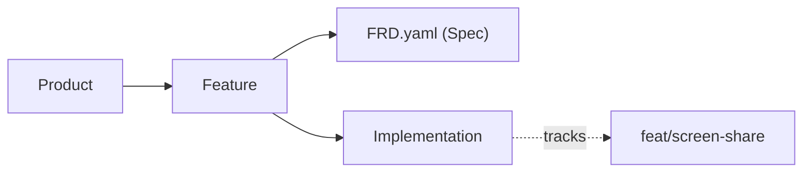

Spec-driven development shifts the focus from diffs and PRs to writing clear requirements and tracking their implementations. This document outlines best practices and how `acai.sh` organizes projects to help you ship higher-quality software.

## Key Principles

<Card title="Focus on intended behavior" icon="goal" horizontal>
  Your FRD should describe what your software *should* do, not what it currently does. Think of it as a specification for the future state of your feature.
</Card>

<Card title="Keep spec and tracker separate" icon="list-todo" horizontal>
  FRDs are for specifying requirements. Use external tooling like Acai to track implementation status, coverage, and progress.
</Card>

<Card title="Function, not form" icon="palette" horizontal>
  Requirements should describe what the software *does*, not how it *looks*.
</Card>

<Card title="Features are toggleable" icon="toggle-left" horizontal>
  A good feature can be delivered on its own, and can be toggled with a feature flag. If you can't flag it, it might be too small (a task) or too large (a product).
</Card>

---

## The Spec

Every spec is an [FRD](/writing-frds) — a single `FRD.yaml` file that defines exactly one feature. There is a 1:1 relationship between a feature and its spec.

Each implementation has one canonical spec at a time. When the spec changes, all implementations reference the updated version — there is no per-implementation copy of the spec.

Specs are most commonly colocated with your code in a `features/` folder, but they don't have to be. A spec can live in:
- A separate documentation or spec repository
- A shared monorepo that multiple teams reference
- The cloud, managed entirely through acai.sh

This flexibility matters for larger organizations where a single feature may span multiple codebases — the spec stays singular and authoritative, no matter where it lives.

---

## How acai.sh Organizes Things

Understanding these four fundamental concepts will help you structure your work effectively:

### 1. Product

A **Product** is any software system that has many features. It can be a microservice, an API, an SDK, a robot, a data pipeline, a mobile app, or a website.

### 2. Feature

A **Feature** is a clearly delineated "slice" of your software that brings value to the user. One helpful way to draw a boundary is to ask: can I enable/disable this behind a feature flag?

**Example**: If you're building a video conferencing app, some features might be `"screen-share"`, `"message-reactions"`, or `"mute-speaker"`.

Features are totally separate from your system's components, modules, and views. They only care about your user and the user's end-goal.

<Warning>
  These are **not** features, and don't belong in your spec:
  - Under-the-hood changes, performance and plumbing
  - A style, layout, or color theme change (unless critical for UX acceptance)
  - Changesets, bugfixes, status updates (or anything that quickly becomes obsolete)
</Warning>

### 3. Requirement

A **Requirement** is a specific behavior that must work for your feature to be accepted.

Good requirements are:
- **Functional** — they help your user *do* something
- **Objective** — they can be verified (passed or failed)
- **Specific** — they describe the expected behavior clearly

### 4. Implementation

An **Implementation** is a specific attempt at fulfilling a feature's requirements in a codebase. A single feature might have multiple implementations (e.g., a "Dev" implementation on a feature branch, and a "Production" implementation on the main branch).

To learn more about how implementations are tracked across branches and multiple repositories, see our [GitOps Guide](/gitops).

---

## Project Structure

By default, Acai looks for FRDs in the `features` folder at the root of your project. By convention, you should organize your project like this:

<Tree>
  <Tree.Folder name="my-project" defaultOpen>
      <Tree.Folder name="features" defaultOpen>
          <Tree.Folder name="animated-terminal" defaultOpen>
              <Tree.Folder name="artifacts">
                <Tree.File name="desktop_wireframe.jpg" />
                <Tree.File name="mobile_wireframe.jpg" />
              </Tree.Folder>
            <Tree.File name="FRD.yaml" />
          </Tree.Folder>
      </Tree.Folder>
  </Tree.Folder>
</Tree>

---

## Tracking and Maintenance

### Status Tracking

Status and assignments live outside the FRD, and is managed by external tooling like `acai.sh`. 

The happy path is typically: `TODO` → `ASSIGNED` → `IMPLEMENTED` → `ACCEPTED`.
